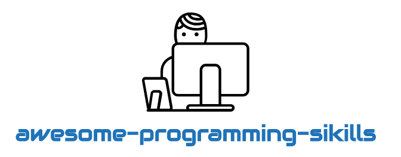
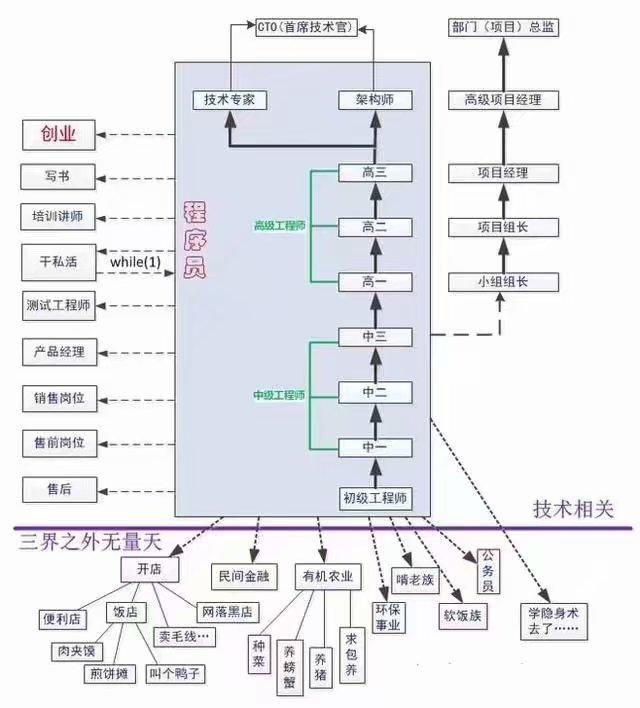

# 程序员的野蛮生长

> :expressionless: 程序猿是怎样炼成的？

<div align="center">
    
</div>


|       :coffee:        |            :game_die:             |     :floppy_disk:     | :globe_with_meridians: |      :curry:       | :computer: |     :art:     |     :iphone:     | :spider_web: |      :cloud:      |    :bulb:     | :building_construction: | :herb: | :slot_machine: | :wrench: | :yellow_heart: |
| :-------------------: | :-------------------------------: | :---------------: | :-----------: | :-------------------: | :--------------------: | :-----------: | :---------------: | :-----------: | :---------------------: | ----------------------- | :---------------------: | ----------------------- | ----------------------- | ----------------------- | ----------------------- |
| [编程语言](#1-编程语言) | [数据结构与算法](#2-数据结构与算法) | [数据库](#3-数据库) | [计算机网络](#4-计算机网络) | [操作系统](#5-操作系统) |      [理解计算机](#6-理解计算机)      | [前端/小程序](#7-前端小程序) | [移动端](#8-移动端) | [后端技术栈](#9-后端技术栈) | [大数据](#10-大数据) | [设计和编码](#11-设计和编码) |  [软件工程](#12-软件工程)  |  [区块链](#13-区块链)  |  [人工智能](#14-人工智能)  |  [工具](#15-工具)  |  [写在最后](#16-写在最后)  |

校招、实习、秋招：

- [校园招聘、实习生招聘、秋招的区别是什么？ - 牛客网的回答 - 知乎](https://www.zhihu.com/question/287147025/answer/459385101)
- 编程剑谱：[带你深刻认知在校期间的几种实习！](https://mp.weixin.qq.com/s/buvryUK5NyKPOQHPag1kfQ) - 对于在校期间的实习，分为日常实习、暑期实习、入职前实习。

应聘职位及相应要求的技能：

- [入职阿里一年后，回头谈谈当初的“所作所为”（一）](<https://mp.weixin.qq.com/s?__biz=MzU4OTg0MTUyNg==&mid=2247483656&idx=1&sn=142ae1f23893ba19c4551f7406056a02&chksm=fdc61411cab19d077672076ab488e10e21cbf15b8a45ae57713d8383e9b83a46db2e135cd8b7&scene=21#wechat_redirect>)

面试求职经验分享：

- [双非本科照样拿腾讯offer，一起看看这位同学的秋招经历吧](https://mp.weixin.qq.com/s/7SL8BvuNwCgm3JcnDiHbow)

IT 职位及待遇： 

- [IT 职位及待遇.md](./Notes/IT职位及待遇.md)

技术认知/思考：

- 码农翻身刘欣：[我所经历的二十年技术演变，一路狂奔到今天](https://mp.weixin.qq.com/s/BV25ngvWgbO3_yMK7eHhew) - 1.  渐进性的技术；2. 基础性的技术；3. 颠覆性的技术：从桌面发展到互联网；4.  新兴技术 


---


## 1. 编程语言

### 深入认识编程语言

1）关于静态/动态语言，强/弱语言

- [JS是动态弱类型语言的理解](<https://github.com/muwenzi/Program-Blog/issues/34>) - 这个看下。[荐]

2）什么是脚本语言、编译语言？

- [什么是脚本语言？什么是解释性语言？什么是编译性语言？](https://www.cnblogs.com/Vdiao/p/5866006.html)
- [脚本语言和编程语言的区别是什么？_百度知道](<https://zhidao.baidu.com/question/76329051.html>)
- [编译语言、解释语言与脚本语言之间的区别 - CSDN博客](<https://blog.csdn.net/WaitForFree/article/details/38796977>)

### Java

先认识这门语言：

- [为什么可以说Java语言是准动态语言？](https://www.cnblogs.com/greatfish/p/5981841.html)

系列文章：

- 公众号「Java技术栈」：[Java 核心编程技术干货](https://mp.weixin.qq.com/s/-KbOyp4gXYY4Ok8S-rPa6Q)

文章博文：

- [内存溢出和内存泄漏的区别、产生原因以及解决方案 - CSDN博客](<https://blog.csdn.net/jingzi123456789/article/details/84196357>)

#### Java 虚拟机(JVM)

JVM 垃圾回收：（推荐下面几篇文章）

- [咱们从头到尾说一次 Java 的垃圾回收](<https://mp.weixin.qq.com/s/feJKRqYJTVEIxl6jvjevAg>)
- [图解 Java 垃圾回收机制](<https://mp.weixin.qq.com/s/vPp4hFGJbHQoCdappm7Qww>)
- [图解Java 垃圾回收机制 - 书呆子Rico](<https://blog.csdn.net/justloveyou_/article/details/71216049> )


### Python

文章博文：

- GitHub：[Python](<https://github.com/TwoWater/Python>) - 草根学 Python（基于Python3.6）  [荐]
- GitHub：[notes-python](<https://github.com/lijin-THU/notes-python>) - 中文 Python 笔记。  [荐]
- [pyc和py文件的区别 - CSDN](<https://blog.csdn.net/taotiezhengfeng/article/details/72236323#>)


## 2. 数据结构与算法

- [算法分析神器—时间复杂度](https://mp.weixin.qq.com/s?__biz=MzIwNTc4NTEwOQ==&mid=2247484623&idx=2&sn=28edc20abe67e2fb4cddad006b1ddf52&chksm=972ad5b5a05d5ca3547710ad2ea22b38ff245645873410db3049e0f0f368fe6924cea62c0011&mpshare=1&scene=23&srcid=0225Ss7lFz7X1VLqNlxCyhDO#rd)

### 学习教程

- [数据结构与算法之美 | 极客时间](<https://time.geekbang.org/column/intro/126>)


## 3. 数据库


## 4. 计算机网络

### 硬件认识

- 码农翻身刘欣：[我是一个交换机，集线器你一边呆着去！](https://mp.weixin.qq.com/s/m_NxUccQ64OnBMVJH0d5kQ)
- 码农翻身刘欣：[我是一个网卡](https://mp.weixin.qq.com/s/vyHlB9pem4rv4htJS9ca6Q)

### HTTP/HTTPS/DNS

对称加密、非对称加密、加密算法：

- [对称加密、非对称加密及其数学原理.md](./08-理解计算机/对称加密、非对称加密及其数学原理.md)
- [加密货币常见加密算法](https://medium.com/@robinwan/%E5%8A%A0%E5%AF%86%E8%B4%A7%E5%B8%81%E5%B8%B8%E8%A7%81%E5%8A%A0%E5%AF%86%E7%AE%97%E6%B3%95-c305942d42ca) - 加密分类以及各加密算法都有介绍到。

域名、“域名劫持”、“域名污染”、DNS：

- [根域名的知识 - 阮一峰的网络日志](http://www.ruanyifeng.com/blog/2018/05/root-domain.html)
- [扫盲 DNS 原理，兼谈“域名劫持”和“域名欺骗/域名污染” @ 编程随想的博客](https://program-think.blogspot.com/2014/01/dns.html) - 需梯子。

数字签名、数字证书、SSL、HHTPS 等：

- [数字签名是什么？ - 阮一峰的网络日志](http://www.ruanyifeng.com/blog/2011/08/what_is_a_digital_signature.html)
- [图解SSL/TLS协议 - 阮一峰的网络日志](http://www.ruanyifeng.com/blog/2014/09/illustration-ssl.html)
- [数字签名、数字证书与HTTPS是什么关系？ - 知乎](https://www.zhihu.com/question/52493697)
- 编程随想的博客（需梯子）：
  - [数字证书及 CA 的扫盲介绍 @ 编程随想的博客](https://program-think.blogspot.com/2010/02/introduce-digital-certificate-and-ca.html)
  - [扫盲 HTTPS 和 SSL/TLS 协议[0]：引子 @ 编程随想的博客](https://program-think.blogspot.com/2014/11/https-ssl-tls-0.html)
  - [扫盲 HTTPS 和 SSL/TLS 协议[1]：背景知识、协议的需求、设计的难点 @ 编程随想的博客](https://program-think.blogspot.com/2014/11/https-ssl-tls-1.html)
  - [扫盲 HTTPS 和 SSL/TLS 协议[2]：可靠密钥交换的难点，以及身份认证的必要性 @ 编程随想的博客](https://program-think.blogspot.com/2014/11/https-ssl-tls-2.html)
- [TCP/IP - 随笔分类 - 青玉伏案 - 博客园](<https://www.cnblogs.com/ludashi/category/931108.html>)
- [详细解析 HTTP 与 HTTPS 的区别](https://juejin.im/entry/58d7635e5c497d0057fae036)
- [全面了解HTTP和HTTPS（开发人员必备） - 简书](https://www.jianshu.com/p/27862635c077)
- [http2.0的时代真的来了...](https://www.jianshu.com/p/712eb3a65d33)

### 系列文章

- 「码农有道」公众号，协议深林系列文章：https://mp.weixin.qq.com/s/FslsYpofN5vE20TEfJNwrw

### 学习教程

- [《图解HTTP》读书笔记](https://ttop5.gitbooks.io/illustration-http/content/)
- [趣谈网络协议 | 极客时间](<https://time.geekbang.org/column/intro/85>)


## 5. 操作系统

文章：

- [进程与线程的一个简单解释 - 阮一峰的网络日志](<http://www.ruanyifeng.com/blog/2013/04/processes_and_threads.html>) - 进程、线程、互斥锁（Mutual exclusion，缩写 Mutex）、信号量（Semaphore）
- 


## 6. 理解计算机

### 基础认识

字符编码：

- [字符编码笔记：ASCII，Unicode 和 UTF-8 - 阮一峰的网络日志](<http://www.ruanyifeng.com/blog/2007/10/ascii_unicode_and_utf-8.html>)  [荐]
- [中文utf 8占几个byte——UTF-8中一个汉需要占用三个字节](http://www.fly63.com/article/detial/374)

芯片、存储：

- [中兴禁令之芯片为什么这么难做？芯片的基本原理是什么？李永乐老师带你了解！（2018最新）](https://www.youtube.com/watch?v=7MFly82e46Q)

Windows、Linux、Mac OS 区别： 

- [一分钟看懂WINDOWS系统、LINUX系统和苹果操作系统到底有什么区别？](https://www.gonet.com.cn/webduirshow-166.html)  - 实际上 UNIX 操作系统和 C 语言都是由贝尔实验室的汤普森(Ken Thompson)和丹尼斯·里奇(Dennis M. Ritchie)于1971年先后改造发明的，如果说真正的操作系统，世界上只有一个，那就是 UNIX 操作系统。
- [windows系统,Linux和mac os x本质区别是？？？](https://zhidao.baidu.com/question/376563438.html)
- [Mac OS与Linux的区别与联系](https://ask.csdn.net/questions/167343)

操作系统和硬件：

- [驱动工作原理](https://jingyan.baidu.com/article/aa6a2c142f4b750d4c19c482.html)
- [操作系统、驱动和硬件的关系的思考](https://blog.csdn.net/qq_38880380/article/details/78327825)
- [软件是如何驱动硬件的，代码是怎样对计算机实现控制的？](https://blog.csdn.net/mixika99/article/details/53234136)

操作系统和 CPU：

- [操作系统与CPU的指令集的关系是怎样的？| 果壳 科技有意思](<https://www.guokr.com/question/462690/>)
- [操作系统跟cpu架构de关系](https://zhidao.baidu.com/question/746207666641027412.html)

三个讲解 CPU 的视频：[YouTube 传送门](<https://www.youtube.com/playlist?list=PLC7a8fNahjQ8IkiD5f7blIYrro9oeIfJU>)

``` xml
part1 CPU机制
part2 x86的崛起
part3 现代操作系统的起源
```

理解计算机：

- [关于CPU的一些基本知识总结](https://www.cnblogs.com/f-ck-need-u/p/11141636.html)  [荐]
- [图灵和冯诺依曼之间有什么关联](http://webcache.googleusercontent.com/search?q=cache:6ZRbV3ie3IEJ:www.5011.net/lishi/102155.html+&cd=3&hl=zh-CN&ct=clnk)
- [图灵与冯·诺伊曼的区别](http://blog.sciencenet.cn/blog-340399-860479.html)
- [什么是图灵完备？ - 知乎](https://www.zhihu.com/question/20115374)

硬盘存储：

- [硬盘损坏和数据恢复的技术分析-月光博客](http://www.williamlong.info/archives/5173.html?from=singlemessage)

随便看看：

- [上万元的Mac，为什么打游戏又卡画质又差？](https://mp.weixin.qq.com/s/jUX9Bd0dthlAZxdpjaoPcw)
- [漫谈字符集和编码](https://www.cnblogs.com/haoxiaobo/p/6723498.html)

### 学习教程

- [深入浅出计算机组成原理 | 极客时间](<https://time.geekbang.org/column/intro/170>)


## 7. 前端/小程序

前端技术：

- [大前端开发者需要了解的基础编译原理和语言知识](https://juejin.im/entry/595b5fc25188250d9576325a)

小程序：

- 


## 8. 移动端

移动端技术点：

- [PM关于设计那些事儿（一）](<https://mp.weixin.qq.com/s?__biz=MzI5NDQxMjE5Mg==&mid=2247483670&idx=1&sn=b7da0134d88c06c6526b6cd4b9b89543&scene=4#wechat_redirect>) - 关于 px、dp、dip、dpi、sp 等区别


移动操作系统相关文章：

- [华为鸿蒙系统用的什么语言？和安卓有什么区别？](https://mp.weixin.qq.com/s/sew-KfpprtSamJUZCP48yg)


## 9. 后端技术栈

### Web

- [必须掌握的Cookie知识点都在这里](<https://zhuanlan.zhihu.com/p/74179692>)


### 框架篇

- [小白科普：Java EE vs J2EE vs Jakarta EE](https://mp.weixin.qq.com/s/kshjUv3kKfiArIn8MQO3rQ)

#### Spring boot

- <https://github.com/wuyouzhuguli/SpringAll>- 循序渐进，学习Spring Boot、Spring Boot & Shiro、Spring Cloud、Spring Security & Spring Security OAuth2，博客Spring系列源码。 
- <http://www.springboot.wiki/#video> - Spring Boot 教程汇总。
- <http://tengj.top/2017/04/24/springboot0/> - Spring Boot干货系列总纲，嘟嘟独立博客。
- <https://github.com/ityouknow/awesome-spring-boot>- Spring Boot Resources
- <https://github.com/ityouknow/spring-boot-examples> -  Spring Boot 教程、技术栈示例代码，快速简单上手教程。

**Spring Cloud：**

- 

#### Spring Cloud

- <http://www.springcloud.wiki/> - Spring Cloud 微服务教程汇总。

### Docker

- [Docker 入门教程 - 阮一峰的网络日志](http://www.ruanyifeng.com/blog/2018/02/docker-tutorial.html)
- [安装 Docker · Docker —— 从入门到实践](<https://yeasy.gitbooks.io/docker_practice/install/>)  [荐]
- [30 分钟快速入门 Docker 教程 - 掘金](<https://juejin.im/post/5cacbfd7e51d456e8833390c>)
- [Docker 教程 | 菜鸟教程](<https://www.runoob.com/docker/docker-tutorial.html>)
- [Docker —— 从入门到实践-极客学院Wiki](http://wiki.jikexueyuan.com/project/docker-technology-and-combat/)

注：Win10 下安装，要是碰到类似：hyper-v feature is not enabled 报错，按该方法操作<https://blog.csdn.net/javahighness/article/details/64192637>

### 系列文章/大佬博客

- [写这么多系列博客，怪不得找不到女朋友 | zhisheng的博客](<http://www.54tianzhisheng.cn/2018/03/27/blogs/?from=timeline#>)


### 分布式/高并发/高性能

- [怎么理解分布式、高并发、多线程？ - 知乎](<https://zhuanlan.zhihu.com/p/59184812>)  [荐]
- [漫谈何时从单体架构迁移到微服务？](https://mp.weixin.qq.com/s/DuvQ5uWNnBkupXP3cxJfgQ)

### Linux

- [快速上手几个Linux命令：每家公司都有自己的黑话](<https://www.infoq.cn/article/1_ZihxpNyw7gz3GzOaPy>)
- 

### 云服务/云计算

- [IaaS，PaaS，SaaS 的区别 - 阮一峰的网络日志](<http://www.ruanyifeng.com/blog/2017/07/iaas-paas-saas.html>)
- [世上最污技术解读，我竟然秒懂了。](https://mp.weixin.qq.com/s/GRR2QNiVEfV9DFXP2vyj3g)（原文来源知乎：[传送门](https://www.zhihu.com/question/263789393/answer/274245200)）
- 


## 10. 大数据


## 11. 设计和编码


## 12. 软件工程


## 13. 区块链


## 14. 人工智能

### AI入门


### 机器学习

- [机器学习中常见4种学习方法、13种算法和27张速查表！](https://cloud.tencent.com/developer/article/1029070)

### 深度学习


### 知识图谱

- [知识图谱是什么？它是如何成为AI的最强大脑？ - 知乎](https://zhuanlan.zhihu.com/p/45736254)


### AI产品

- [产品小姐姐分析抖音背后的计算机视觉技术](https://mp.weixin.qq.com/s/9tkO1Nf_YLY8bM6jnvWVJQ)


## 15. 工具

### IntelliJ IDEA

- GitHub：[IntelliJ-IDEA-Tutorial](<https://github.com/zhenhappy/IntelliJ-IDEA-Tutorial>) - IntelliJ IDEA 简体中文专题教程。  [荐]
- [IntelliJ IDEA + GitHub(git) 详细图解 如何实现项目的版本控制和管理（on win 7 64 bit）](https://blog.csdn.net/qq_27093465/article/details/52847300)
- Java知音：[最详细的IDEA中使用Debug教程](https://mp.weixin.qq.com/s/3H5VsZu-pNb_b8vJHFmIGg)
- 江南一点雨：[IntelliJ IDEA 2019 从入门到癫狂 图文教程](https://mp.weixin.qq.com/s/YvfGpHXxAFqQ0o8K_NYYrg)

### 版本控制 - Git

- [Linus 介绍 Git 的特点和设计思路_腾讯视频](<https://v.qq.com/x/page/o0772kqh5iv.html>) - 可以知道 Git 诞生背后的故事，以及它的设计思想。

关于 SSH：

- [最佳实践：使用SSH连接Linux服务器](https://www.jianshu.com/p/59c4fc2684be) - SSH 实践原理图。


### 版本控制 - SVN


## 16. 写在最后

### 资料&博主&社区&笔面

- [传送门](./Notes/README.md)

### 一张图道尽程序员的出路

<div align="center">
    
</div>


<div align="right">
    <a href="#程序员的野蛮生长">回到顶部</a>
</div>


> *Logo... Powered by [freelogodesign](https://www.freelogodesign.org/).*


